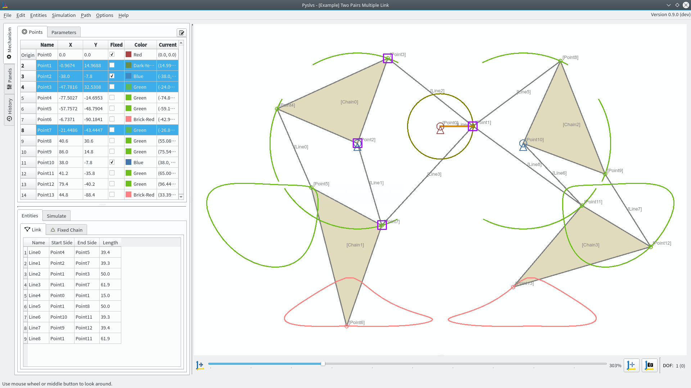
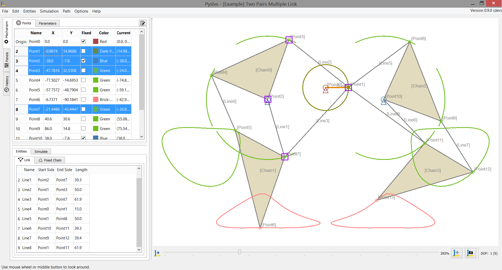

[](https://github.com/KmolYuan/Pyslvs-PyQt5/releases)
[](https://travis-ci.org/KmolYuan/Pyslvs-PyQt5)
[](https://www.python.org/)
[](https://riverbankcomputing.com/software/pyqt/intro)
[](https://github.com/KmolYuan/Pyslvs-PyQt5/releases)
[](https://github.com/KmolYuan/Pyslvs-PyQt5/releases)
[](https://raw.githubusercontent.com/KmolYuan/Pyslvs-PyQt5/master/LICENSE)

[](http://pyslvs.com "Click here go to our website.")

1. [Introduction](#introduction)

    + [How to startup](#how-to-startup)
    + [Symbolic](#symbolic)
    + [Path Track](#path-track)
    + [Triangle Solver](#triangle-solver)
    + [Algorithm](#algorithm)

1. [Modules Requirement](#modules-requirement)

    + [PyQt](#pyqt)

1. [Kernels Requirement](#kernels-requirement)

    + [Python-solvespace Kernel](#python-solvespace-kernel)
    + [Dimensional Synthesis Kernel](#dimensional-synthesis-kernel)

1. [Compile](#compile)

1. [Power By](#power-by)

Introduction
===

A GUI-based tool solving 2D linkage subject.

+ **Planar Linkages Simulation**: Kernel from [Solvespace] with Python bundle (SWIG).

+ **Dimensional Synthesis**: Kernel from three Cython algorithm API (rewrite).

Compatible with Python 3.4, PyQt 5.7 (for PyQtChart) and above.

Cross-platform Development: Ubuntu and Windows OS (64-bit).

**Please note that other platforms may be available but I have not tested before.**

Previews in KDE Plasma desktop:



Previews in Windows 8.1 theme:



How to startup
---

Open GUI by Python:

```bash
python3 launch_pyslvs.py
```

Or see help:

```bash
python3 launch_pyslvs.py --help
```

Symbolic
---

1. Point

    

1. Line (Link)

    

1. Chain (Fixed Chain)

    

1. Shaft (Drive Shaft)

    

1. Slider

    

1. Rod (Piston)

    

Path Track
---


Calculate the move trajectory of the node.


And view them in the table or save as text data.


Triangle Solver
---


Triangle solver find the node position by using three triangular relationship.


Then merge into canvace as well.

Algorithm
---


Contains three algorithms:

+ Real Genetic Algorithm
+ Firefly Algorithm
+ Differential Evolution

Specify a path and options to generate a crank rocker.

This function has a simple TCP ZMQ connecting mode.

Modules Requirement
===

You should install some python module and SDK first.

The Makefile is included at compile steps, so some environment setting also should be set.

**Ubuntu**:

```bash
sudo pip3 install -r requirements.txt
```

**Windows**:

Python 3: [Official Python] for Windows 64 bit.

Makefile tool: [MinGW] for win64.

```bash
pip install -r requirements.txt
```

PyQt
---

Download [Qt5] and install it.

Remember it should include QtChart.

Make sure computer is installed Qt5 and PyQt5 in the same version.

**Ubuntu**:

Ubuntu user has to add Qt file path in user's `QTDIR`, `LD_LIBRARY_PATH`, and `PATH`.

Just like `/opt/Qt/5.9.1/gcc_64/`.

```bash
export QTDIR=/opt/Qt/5.9.1/gcc_64/

export LD_LIBRARY_PATH=${LD_LIBRARY_PATH}:${QTDIR}/lib/

export PATH=${QTDIR}/bin:${PATH}
```

Then relink QMake command (If your desktop is made by earlier Qt version).

```bash
sudo rm /usr/bin/qmake
sudo ln -s /opt/Qt/5.9.1/gcc_64/bin/qmake /usr/bin/qmake
```

Download and upgrade Python [SIP].

Before that, you should remove earlier SIP version.

```python
import sip
print(sip, sip.SIP_VERSION_STR)
```

Then remove SIP from the location:

```bash
sudo rm -fr /usr/local/lib/python3.5/dist-packages/sip*
```

Download and build [PyQt5], [QScintilla2] and [PyQtChart] by self.

**Windows**:

Windows user has to add Qt file path in environment variables, like `C:\Qt\5.9.1\msvc2015_64\bin`.

Install PyQt5, PyQtChart and QScintilla2 by pip.

```bash
pip install -U pyqt5 qscintilla pyqtchart
```

Kernels Requirement
===

Make command:

```bash
make build-kernel
```

This project including 2 kernels should build, please following the steps if you are first time to use.

Python-solvespace Kernel
---

Make command:

```bash
make -C core/kernel/python_solvespace
```

**Ubuntu**:

First, install SWIG. This tool kit can make a Python bundle with C/C++ library.

If your not, install python development kit.

```bash
sudo apt install swig python3-dev
```

**Windows**:

Download and install [SWIG](http://www.swig.org/download.html).

Some conflicts between the Microsoft C Language and Python.

You need change a few of Python files to avoid these conflicts.

But you can be assured that the changes won't cause any negative impact.

1. Python development settings

    If your Python doesn't have development library, like `libpython35.a`, using `gendef` to generate it.

    **In Python 3.6 and above versions, you do not have to do these actions.**

    First copy `python3x.dll` to `where_your_python\libs` folder.

    Then using this command:

    ```bash
    gendef python3x.dll
    dlltool --dllname python3x.dll --def python3x.def --output-lib libpython3x.a
    ```

    And then adjust source code about Visual C. Find this code in `where_your_python\include\pyconfig.h`.

    ```c
    #ifdef _WIN64
    #define MS_WIN64
    #endif
    ```

    Cut them and paste **Above** this:

    ```c
    #ifdef _MSC_VER
    ```

    Find this code in `where_your_python\Lib\distutils\cygwinccompiler.py`:

    ```python
    #with MSVC 7.0 or later.
    self.dll_libraries = get_msvcr()
    ```

    Commit `self.dll_libraries = get_msvcr()`.

1. `math.h` conflict with `pyconfig.h`

    You will definitely get warning with `_hypot` in `pyconfig.h`, and you should do this step.

    In `where_your_python\include\pyconfig.h`, find this:

    ```c
    #define COMPILER "[gcc]"
    #define hypot _hypot
    ```

    Edit it to this:

    ```c
    #define COMPILER "[gcc]"
    #ifndef _MATH_H_
    #define hypot _hypot
    #endif
    ```

Dimensional Synthesis Kernel
---

Make command:

```bash
make -C core/kernel/pyslvs_algorithm
```

**Ubuntu**:

Ubuntu user can compile kernel by Cython directly.

**Windows**:

If you are using 64 bit OS with 64bit Python, unfortunately you **can not** use mingw64 to complete the compilation.

Using Microsoft Visual Studio is the only option, you can get it from [here][visualstudio-link], then startup the Visual Studio Community and install Windows SDK.

When installation finished, see the instructions [here][cython-link] to set up the Windows SDK.

[visualstudio-link]: https://www.visualstudio.com/downloads/
[cython-link]: https://github.com/cython/cython/wiki/CythonExtensionsOnWindows#using-windows-sdk-cc-compiler-works-for-all-python-versions

Compile
===

Use PyInstaller to build.

After following operation, the executable file is located at `dist` folder.

As your wish, it can be renamed or moved out and operate independently in no-Python environment.

**Ubuntu**:

Make command:

```bash
sudo pip3 install pyinstaller
make
```

**Windows**:

Make command:

```bash
pip install pyinstaller
make
```

If you installed PyInstaller with problem of coding error, you can try another source:

```bash
pip install https://github.com/pyinstaller/pyinstaller/archive/develop.zip
```

Power By
===

Made by [Qt5] and Python IDE [Eric 6].

Including Python modules:

* [SIP] (GPLv2, GPLv3)
* [QScintilla2] (GPLv3)
* [PyQt5], [PyQtChart] (GPLv3)
* [dxfwrite] (MIT)
* [numpy] (BSD 3-Clause)
* [Cython] (Apache 2.0)
* [PyZMQ] (New BSD 3-Clause, LGPL, Apache)
* [openpyxl] (MIT)
* [psutil] (BSD)

Pyslvs is under [GNU Affero General Public License v3](https://github.com/KmolYuan/Pyslvs-PyQt5/blob/master/LICENSE).

Here is the **origin kernel** repository:

* [Python-solvespace]
* [Dimensional Synthesis of Planar Four-bar Linkages]
* [Triangle solver]

[Solvespace]: http://solvespace.com
[PyQt5]: https://www.riverbankcomputing.com/software/pyqt/download5
[PyQtChart]: https://www.riverbankcomputing.com/software/pyqtchart/download
[Qt5]: https://www.qt.io/download/
[SIP]: https://riverbankcomputing.com/software/sip/download
[QScintilla2]: https://riverbankcomputing.com/software/qscintilla/download

[Official Python]: https://www.python.org/
[MinGW]: https://sourceforge.net/projects/mingw-w64/files/

[Eric 6]: http://eric-ide.python-projects.org/

[numpy]: http://www.numpy.org/
[dxfwrite]: https://pypi.python.org/pypi/dxfwrite/
[Cython]: http://cython.org/
[PyZMQ]: http://zeromq.org/bindings:python
[openpyxl]: http://openpyxl.readthedocs.io/
[psutil]: https://github.com/giampaolo/psutil

[Python-solvespace]: https://github.com/KmolYuan/python-solvespace
[Dimensional Synthesis of Planar Four-bar Linkages]: https://github.com/kmollee/algorithm
[Triangle solver]: https://gist.github.com/KmolYuan/c5a94b769bc410524bba66acc5204a8f
