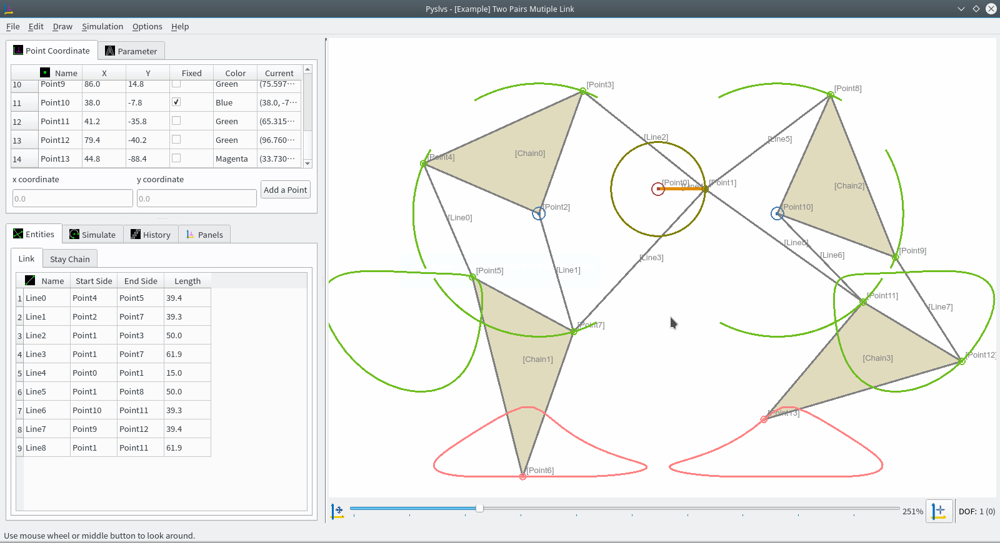

Pyslvs(PySolveSpace)
===


A GUI-based tool solving 2D linkage subject.

Compatible with Python 3.4, PyQt 5.5 and above.



How to startup
---

Open GUI by Python:

```bash
$python3 launch_pyslvs.py
```

Or see help:

```bash
$python3 launch_pyslvs.py --help
```

Compile
===

Linux & Mac
---

Use PyInstaller or cxFreeze as you like.

First, enter the storage folder.

```bash
$sudo pip3 install PyInstaller
$make
```

Windows
---

Python 3: [Anaconda] for Windows 64 bit.

Use both PyInstaller and cxFreeze to build.

Other require installation: [MinGW] for win64.

First, enter the storage folder.

```bash
>pip install https://github.com/pyinstaller/pyinstaller/archive/develop.zip
>pip install cx_Freeze
>make
```

And than, the executable folder is located at `dist` / `launch_pyslvs` folder.

As your wish, it can be renamed or moved out and operate independently in no-Python environment.

Collaboration
===

The manual is being written, you can see [here](https://github.com/40323230/Pyslvs-manual/).

Power By
===

Made by PyQt 5.7 and Python editor [Eric 6].

Including Python module: [PyQt5], [peewee], [dxfwrite]

Here is the **origin kernel** repository:

* https://github.com/KmolYuan/python-solvespace

* https://github.com/kmollee/django-project-template

If your Python version or platform is not compatible, maybe you should build them by self.

[Anaconda]: https://www.continuum.io/downloads
[MinGW]: https://sourceforge.net/projects/mingw-w64/files/latest/download?source=files
[Eric 6]: http://eric-ide.python-projects.org/
[PyQt5]: http://doc.qt.io/qt-5/index.html
[peewee]: http://docs.peewee-orm.com/en/latest/
[dxfwrite]: https://pypi.python.org/pypi/dxfwrite/
