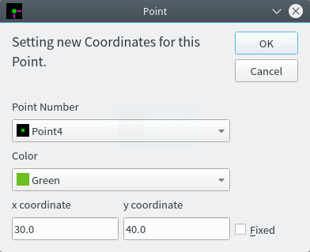
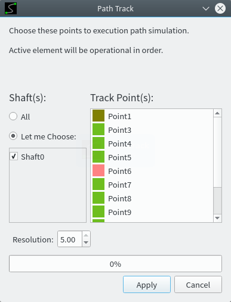
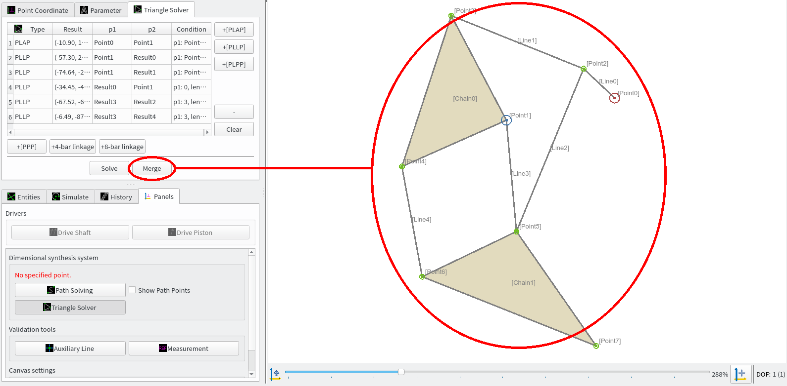

[](https://travis-ci.org/KmolYuan/Pyslvs-PyQt5)
[%2C%20Windows-blue.svg)](https://github.com/KmolYuan/Pyslvs-PyQt5/releases)
[](https://github.com/KmolYuan/Pyslvs-PyQt5/releases)
[](https://raw.githubusercontent.com/KmolYuan/Pyslvs-PyQt5/master/LICENSE)


1. [Introduction](#introduction)

    + [How to startup](#how-to-startup)
    + [Symbolic](#symbolic)
    + [Path Track](#path-track)
    + [Triangle Solver](#triangle-solver)
    + [Algorithm](#algorithm)

1. [Requirement](#requirement)

    + [PyQt](#pyqt)

1. [Compile](#compile)

1. [Power By](#power-by)

    + [Kernels](#kernels)

Introduction
===

A GUI-based tool solving 2D linkage subject.

+ **Planar Linkages Simulation**: Kernel from Solvespace Python bundle.

+ **Dimensional Synthesis**: Kernel from three Cython algorithm API.

Compatible with Python 3.4, PyQt 5.7 (for PyQtChart) and above.

Cross-platform Development: Ubuntu and Windows OS


How to startup
---

Open GUI by Python:

```bash
$python3 launch_pyslvs.py
```

Or see help:

```bash
$python3 launch_pyslvs.py --help
```

Symbolic
---

1. Point

    

1. Line (Link)

    

1. Chain (Fixed Chain)

    

1. Shaft (Drive Shaft)

    

1. Slider

    

1. Rod (Piston)

    

Path Track
---



Calculate the path of the node.


View them in the table.


Triangle Solver
---


Triangle solver find the node position by using three triangular relationship.



Then merge into canvace as well.

Algorithm
---


Contains three algorithms:

+ Genetic Algorithm
+ Firefly Algorithm
+ Differential Evolution

Specify a path and options to generate a crank rocker.

Requirement
===

You should install some python module first.

**Linux**:

```bash
$sudo pip3 install -r requirements.txt
```

**Windows**:

```bash
>pip install -r requirements.txt
```

PyQt
---

Download [Qt5] and install it.

Remember it should include QtChart.

Make sure computer is installed Qt5 and PyQt5 in the same version.

**Linux**:

Linux user has to add Qt file path in user's `QTDIR`, `LD_LIBRARY_PATH`, and `PATH`.

Just like `/opt/Qt/5.9.1/gcc_64/`.

```bash
export QTDIR=/opt/Qt/5.9.1/gcc_64/

export LD_LIBRARY_PATH=${LD_LIBRARY_PATH}:${QTDIR}/lib/

export PATH=${QTDIR}/bin:${PATH}
```

Then relink QMake command (If your desktop is made by earlier Qt version).

```bash
$sudo rm /usr/bin/qmake
$sudo ln -s /opt/Qt/5.9.1/gcc_64/bin/qmake /usr/bin/qmake
```

Download and upgrade Python [SIP].

Before that, you should remove earlier SIP version.

```python
import sip
print(sip, sip.SIP_VERSION_STR)
```

Then remove SIP from the location:

```bash
$sudo rm -fr /usr/local/lib/python3.5/dist-packages/sip*
```

Download and build [PyQt5], [QScintilla2] and [PyQtChart] by self.

**Windows**:

Windows user has to add Qt file path in environment variables, like `C:\Qt\5.9.1\msvc2015_64\bin`.

Install PyQt5, PyQtChart and QScintilla2 by pip.

```bash
>pip install -U pyqt5 qscintilla pyqtchart
```

Compile
===

Use PyInstaller to build.

After following operation, the executable file's folder is located at `dist` / `launch_pyslvs` folder.

As your wish, it can be renamed or moved out and operate independently in no-Python environment.

**Linux**:

First, enter the storage folder.

```bash
$sudo pip3 install pyinstaller
$make
```

**Windows**:

Python 3: [Official Python] for Windows 64 bit.

Makefile tool: [MinGW] for win64.

First, enter the storage folder.

```bash
>pip install pyinstaller
>make
```

If you installed PyInstaller with problem of coding error, you can try another source:

```bash
>pip install https://github.com/pyinstaller/pyinstaller/archive/develop.zip
```

Power By
===

Made by [Qt5] and Python IDE [Eric 6].

Including Python module:

* [PyQt5]
* [peewee]
* [dxfwrite]
* [Cython]
* [PyZMQ]
* [openpyxl]

Here is the **origin kernel** repository:

* [Python-solvespace]
* [Dimensional Synthesis of Planar Four-bar Linkages]
* [Triangle solver]

Kernels
---

Compiled binary files is in the `core/kernel` folder.

* Ubuntu (64 bit): Python 3.4, Python 3.5

* Windows (64 bit): Python 3.5, Python 3.6

If your Python version or platform is not compatible, maybe you should build them by self.

Dimensional Synthesis kernel source code is included at compile steps.

If you want to obtain it independently, just follow this step:

```bash
cd core/kernel/pyslvs_generate
make
```

[PyQt5]: https://www.riverbankcomputing.com/software/pyqt/download5
[PyQtChart]: https://www.riverbankcomputing.com/software/pyqtchart/download
[Qt5]: https://www.qt.io/download/
[SIP]: https://riverbankcomputing.com/software/sip/download
[QScintilla2]: https://riverbankcomputing.com/software/qscintilla/download

[Official Python]: https://www.python.org/
[MinGW]: https://sourceforge.net/projects/mingw-w64/files/

[Eric 6]: http://eric-ide.python-projects.org/
[peewee]: http://docs.peewee-orm.com/en/latest/
[dxfwrite]: https://pypi.python.org/pypi/dxfwrite/
[Cython]: http://cython.org/
[PyZMQ]: http://zeromq.org/bindings:python
[openpyxl]: http://openpyxl.readthedocs.io/

[Python-solvespace]: https://github.com/KmolYuan/python-solvespace
[Dimensional Synthesis of Planar Four-bar Linkages]: https://github.com/kmollee/algorithm
[Triangle solver]: https://gist.github.com/KmolYuan/c5.9.14b769bc410524bba66acc5204a8f
