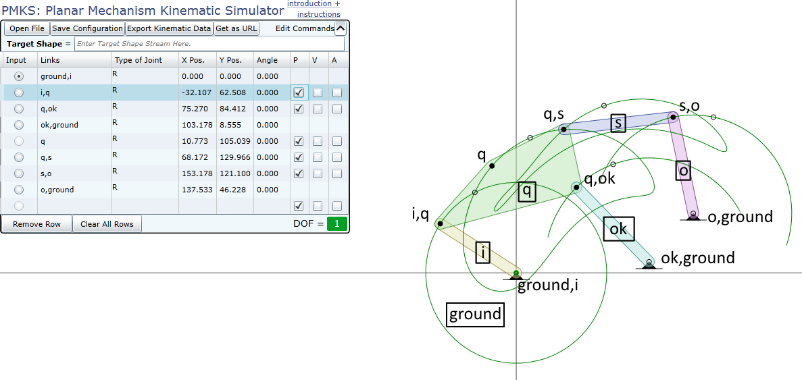
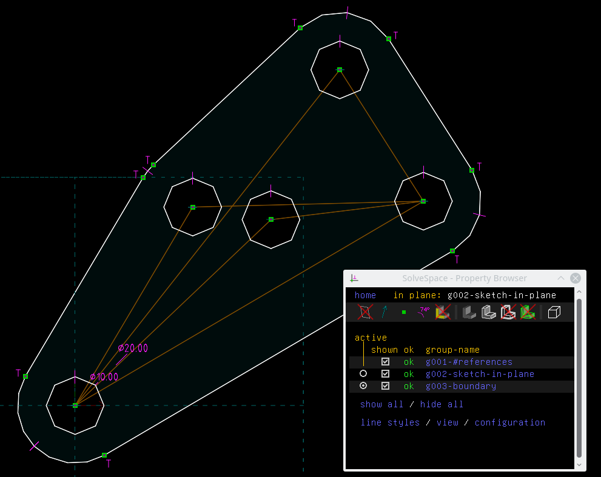

# Features

A GUI-based tool used to design 2D linkage mechanism.

+ **Planar Linkages Simulation**

    - [Python-Solvespace]: Kernel from [Solvespace] with Cython bundle.
    - [Pyslvs]: Kernel from [Sketch Solve] with [Cython]. Including creative design method for planar mechanism.

+ **Mechanical Synthesis**

    - **Number Synthesis**: Combine the attributes of mechanism.
    - **Structural Synthesis**: Cython algorithm used to find out structural possibilities of the mechanism.
    - **Dimensional Synthesis**: Kernel from the three Cython algorithms (rewrite).

+ **Others**

    - Cross three platforms.
    - CAD-like user interface.
    - Auto layout of generalized chain.
    - The code complies with PEP8.

## Previews

Previews in Ubuntu with KDE Plasma desktop:


Previews in Windows 10 theme:


Previews in macOS Sierra with fusion theme:


## Design Method

Three-steps design flow:

+ Structure Synthesis
+ Dimensional Synthesis
+ Kinematic Simulation

Including sequential processes and backward analysis.


## Symbolic

Referring symbolic from [PMKS](http://designengrlab.github.io/PMKS/).

The PMKS expression is using a name label to present a link bar.

A joint between two links will get two name labels, and so on.

The "ground" label is a default name, this link will be the absolute coordinate in the system, might be a frame of your mechanism.



Pyslvs was translate the PMKS expression as a string, likes below:

```pmks
# Single line annotation.
M[
    J[R, color[Green], P[0.0, 0.0], L[ground, link_0]],
    J[R, color[Green], P[12.92, 32.53], L[link_0, link_1]],
    J[R, color[Green], P[73.28, 67.97], L[link_1, link_2]],
    J[R, color[Green], P[33.3, 66.95], L[link_1]],
    J[R, color[Green], P[90.0, 0.0], L[ground, link_2]],
]
```

Then the expression can be parse in Pyslvs to create the mechanism.

The grammar is defined with Extended Backus–Naur Form (EBNF), you can checkout the source code of parser.

## Kinematics Simulation

Pyslvs has a simple simulation function driving with revolute joints.

There is a planar constraint solving mechanism done with three CAD kernels:

+ Pyslvs and Sketch Solve.
+ Python-Solvespace.
+ Sketch Solve.

Choose a base point and a driver point for the shaft, then add this dependent into variables list.

Using QDial widget (it just like a turntable) to adjust the angle value of variable.

Path data will start append coordinates (between a certain of distance) after press the "record" button. Press "record" button again to stop recording.

Path data can be copy or switch visibility by right-click menu.

Some exceptions are not support:

+ Other type of joints.
+ Degree of freedom was lower than 1 but still can moving.

## Structural Synthesis

Analysis a type of mechanism that exists, and find out other possibilities.

We have a topological algorithm to combine atlas with:

+ Same degree of freedom.
+ Same number of link.
+ Same number of joint.

And use a type of mechanism to do grounding combine.

Grounding combine can merge the structure graph immediately to canvas.

But in the common ways, you can give it to dimensional synthesis to make it more useful.

## Structural Configuration

Before doing dimensional synthesis, a structure graph has same option when mapping to target mechanism.

+ Grounded link: The link is used as mechanism frame.
+ Inputs: Mechanism angle variables decided by joint pairs.
+ Target joints: Several joints that need to match target paths.

Result variable configuration will have:

+ Position of grounded joints.
+ Length of links.
+ Inputs angle.

## Dimensional Synthesis

Generate a mechanism with path requirement by random variables.

+ The structure settings is get from variable configuration.
+ There also have algorithm options, such like constraints or probability.

Contains three algorithms:

+ Real-coded Genetic Algorithm
+ Firefly Algorithm
+ Differential Evolution

## IO Support

Pyslvs can support for following format.

**Output formats**:

+ Pyslvs [YAML] based workbook (*.pyslvs.yml).
+ Pyslvs workbook database (*.pyslvs).
+ Expression (just a string).
+ [Solvespace] format (*.slvs).
+ DXF format (*.dxf).
+ Image capture (all of [Qt supports]).

[Qt supports]: http://doc.qt.io/qt-5/qimage.html#reading-and-writing-image-files

**Input formats**:

+ Pyslvs [YAML] based workbook (*.pyslvs.yml).
+ Pyslvs workbook database (*.pyslvs).
+ Expression (just a string).
+ [Solvespace] format (*.slvs, only supports very few of constraints).

The workbook mechanism will generate the sketch frame as \*.slvs format like follow:


A part file will split the sketch and boundary with two groups.



The part files can be import to assemble with main sketch file. However, the 3D features still can not be generated from external program yet, so user need to do it by self.

For the IO method of Solvespace format, you can also refer to two Python scripts 'read' and 'write' in Pyslvs IO module.

[Solvespace]: https://github.com/solvespace/solvespace
[Cython]: http://cython.org/
[YAML]: https://yaml.org/

[Python-Solvespace]: https://github.com/KmolYuan/python-solvespace
[Pyslvs]: https://github.com/KmolYuan/pyslvs
[Sketch Solve]: https://code.google.com/archive/p/sketchsolve/
