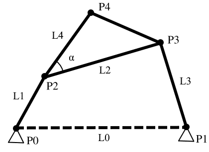

# Pyslvs API

## Module `pyslvs`

Kernel of Pyslvs.

### all_collections()

*Full name:* `pyslvs.all_collections`

| return |
|:------:|
| `Iterator[str]` |

Get all collection names.

### all_examples()

*Full name:* `pyslvs.all_examples`

| return |
|:------:|
| `Iterator[str]` |

Get all example names.

### class Collection

*Full name:* `pyslvs.Collection`

| Bases |
|:-----:|
| `TypedDict` |

| Members | Type |
|:-------:|:----:|
| `cus` | `Dict[int, int]` |
| `expression` | `str` |
| `graph` | `Sequence[Tuple[int, int]]` |
| `input` | `Sequence[Tuple[Tuple[int, int], Sequence[float]]]` |
| `placement` | <code>Dict[int, Tuple[float, float, float] &#124; None]</code> |
| `same` | `Dict[int, int]` |
| `target` | <code>Dict[int, Sequence[Tuple[float, float]] &#124; None]</code> |

### collection_list()

*Full name:* `pyslvs.collection_list`

| key | return |
|:---:|:------:|
| `str` | `Collection` |

The example data of collections.

The format of each configuration is:

+ `expression`: Mechanism expression of the structure.
    + type: str
+ `input`: Input pairs.
    + type: Sequence[Tuple[int, int]]
+ `graph`: The generalized chain graph in edge set.
    + type: Sequence[Tuple[int, int]]
+ `placement`: The grounded joints setting. (`x`, `y`, `r`)
    + type: Dict[int, Optional[Tuple[float, float, float]]]
+ `target`: The target joints settings.
    + type: Dict[int, Optional[Sequence[Tuple[float, float]]]]
+ `cus`: The custom joints on specific link. (link number correspond to
    the graph expression.)
    + type: Dict[int, int]
+ `same`: The multiple joints setting.
    + type: Dict[int, int]

### color_rgb()

*Full name:* `pyslvs.color_rgb`

| name | return |
|:----:|:------:|
| `str` | `Tuple[int, int, int]` |

Get color by name.

Get RGB color data by name, return `(0, 0, 0)` if it is invalid.
Also support `"(R, G, B)"` string format.

### class Coord

*Full name:* `pyslvs.Coord`

| Members | Type |
|:-------:|:----:|
| `x` | `float` |
| `y` | `float` |

A data class used to store coordinates.

#### Coord.\_\_init\_\_()

*Full name:* `pyslvs.Coord.__init__`

| self | x | y | return |
|:----:|:---:|:---:|:------:|
| `Self` | `float` | `float` | `Any` |

Initialize self.  See help(type(self)) for accurate signature.

#### Coord.distance()

*Full name:* `pyslvs.Coord.distance`

| self | p | return |
|:----:|:---:|:------:|
| `Self` | `Coord` | `float` |

Return the distance between two coordinates.

#### Coord.is_nan()

*Full name:* `pyslvs.Coord.is_nan`

| self | return |
|:----:|:------:|
| `Self` | `bool` |

Return true if the coordinate value is not a number.

#### Coord.slope_angle()

*Full name:* `pyslvs.Coord.slope_angle`

| self | p | return |
|:----:|:---:|:------:|
| `Self` | `Coord` | `float` |

Slope angle of two coordinates.

### edges_view()

*Full name:* `pyslvs.edges_view`

| graph | return |
|:-----:|:------:|
| `pyslvs.expression_parser.graph.Graph` | `Iterator[Tuple[int, Tuple[int, int]]]` |

The iterator will yield the sorted edges from `graph`.

### efd_fitting()

*Full name:* `pyslvs.efd_fitting`

| path | n | return |
|:----:|:---:|:------:|
| <code>Sequence[Tuple[float, float]] &#124; numpy.ndarray</code> | `int` | `numpy.ndarray` |
|   | `0` |   |   |

Curve fitting using Elliptical Fourier Descriptor.

The path `path` will be translated to Fourier descriptor coefficients,
then regenerate a new path as a `n` x 4 NumPy array.

### class EStack

*Full name:* `pyslvs.EStack`

| Members | Type |
|:-------:|:----:|
| `well_done` | `bool` |

Triangle solution stack, generated from [`t_config`](#t_config).
It is pointless to call the constructor.

#### EStack.as_list()

*Full name:* `pyslvs.EStack.as_list`

| self | return |
|:----:|:------:|
| `Self` | `List[Tuple[str, ...]]` |

Copy the dataset as list object.

### example_list()

*Full name:* `pyslvs.example_list`

| key | return |
|:---:|:------:|
| `str` | `Tuple[str, Sequence[Tuple[int, int]]]` |

The example data of mechanisms.

The format of each mechanism is:

+ `[0]`: Mechanism expression.
    + type: str
+ `[1]`: Input pairs.
    + type: Tuple[Tuple[int, int], ...]]

### expr_solving()

*Full name:* `pyslvs.expr_solving`

| exprs | vpoints | angles | return |
|:-----:|:-------:|:------:|:------:|
| `pyslvs.tinycadlib.topo_config.EStack` | `Sequence[pyslvs.tinycadlib.expression.VPoint]` | <code>Mapping[Tuple[int, int], float] &#124; None</code> | <code>List[_Coord &#124; Tuple[_Coord, _Coord]]</code> |
|   |   | `None` |   |   |

Solver function of Triangular method and BFGS method, for mechanism
expression `vpoints`.

The triangle expression stack `expr` is generated from
[`t_config`](#t_config).

Solver function will not handle slider input pairs in argument `angles`,
which is only support revolute joints. In another way, the slider input
pairs can be set by [`VPoint.disable_offset()`](#vpointdisable_offset)
method.

### get_include()

*Full name:* `pyslvs.get_include`

| return |
|:------:|
| `str` |

Get include directory.

### get_vlinks()

*Full name:* `pyslvs.get_vlinks`

| vpoints | return |
|:-------:|:------:|
| `Iterable[VPoint]` | `List[VLink]` |

Get VLinks from a list of VPoint `vpoints`.

### graph2vpoints()

*Full name:* `pyslvs.graph2vpoints`

| graph | pos | cus | same | grounded | return |
|:-----:|:---:|:---:|:----:|:--------:|:------:|
| `pyslvs.expression_parser.graph.Graph` | `Dict[int, Tuple[float, float]]` | <code>Dict[int, int] &#124; None</code> | <code>Dict[int, int] &#124; None</code> | <code>int &#124; None</code> | `List[pyslvs.expression_parser.expression.VPoint]` |
|   |   | `None` | `None` | `None` |   |   |

Transform `graph` into [VPoint] objects. The vertices are mapped to links.

+ `pos`: Position for each vertices.
+ `cus`: Extra points on the specific links.
+ `same`: Multiple joint setting. The joints are according to [`edges_view`](#edges_view).
+ `grounded`: The ground link of vertices.

### class LinkArgs

*Full name:* `pyslvs.LinkArgs`

| Decorators |
|:----------:|
| `@dataclasses.dataclass(repr=False, eq=False)` |

| Members | Type |
|:-------:|:----:|
| `color` | `str` |
| `name` | `str` |
| `points` | `str` |

Link table argument.

### palp()

*Full name:* `pyslvs.palp`

| c1 | a0 | d0 | c2 | inverse | return |
|:---:|:---:|:---:|:---:|:-------:|:------:|
| `pyslvs.tinycadlib.expression.Coord` | `float` | `float` | `pyslvs.tinycadlib.expression.Coord` | `bool` | `pyslvs.tinycadlib.expression.Coord` |
|   |   |   |   | `False` |   |   |

The PALP function requires two points, one angle and one distance,
obtained the position of fourth point.

In the following picture, `c1` correspond to "A", `c2` correspond to "B",
`d0` correspond to "L0", `a0` correspond to "alpha", `return` correspond
to "C".


Set `inverse` option to `True` can make the result upside down.

### parse_params()

*Full name:* `pyslvs.parse_params`

| expr | return |
|:----:|:------:|
| `str` | `List[PointArgs]` |

Parse mechanism expression into VPoint constructor arguments.

### parse_pos()

*Full name:* `pyslvs.parse_pos`

| expr | return |
|:----:|:------:|
| `str` | `List[Tuple[float, float]]` |

Parse mechanism expression into coordinates.

### parse_vlinks()

*Full name:* `pyslvs.parse_vlinks`

| expr | return |
|:----:|:------:|
| `str` | `List[pyslvs.expression_parser.expression.VLink]` |

Parse mechanism expression into VLink objects.

### parse_vpoints()

*Full name:* `pyslvs.parse_vpoints`

| expr | return |
|:----:|:------:|
| `str` | `List[pyslvs.expression_parser.expression.VPoint]` |

Parse mechanism expression into VPoint objects.

### plap()

*Full name:* `pyslvs.plap`

| c1 | d0 | a0 | c2 | inverse | return |
|:---:|:---:|:---:|:---:|:-------:|:------:|
| `pyslvs.tinycadlib.expression.Coord` | `float` | `float` | <code>pyslvs.tinycadlib.expression.Coord &#124; None</code> | `bool` | `pyslvs.tinycadlib.expression.Coord` |
|   |   |   | `None` | `False` |   |   |

The PLAP function requires two points, one distance and one angle,
obtained the position of third point. The unit of `a0` is degree.

In the following picture, `c1` correspond to "A", `c2` correspond to "B",
`d0` correspond to "L0", `a0` correspond to "beta", `return` correspond
to "C".
If `c2` is not given, "alpha" will be set to zero.


Set `inverse` option to `True` can make `a0` value as negative.

### pllp()

*Full name:* `pyslvs.pllp`

| c1 | d0 | d1 | c2 | inverse | return |
|:---:|:---:|:---:|:---:|:-------:|:------:|
| `pyslvs.tinycadlib.expression.Coord` | `float` | `float` | `pyslvs.tinycadlib.expression.Coord` | `bool` | `pyslvs.tinycadlib.expression.Coord` |
|   |   |   |   | `False` |   |   |

The PLLP function requires two points and two distances, obtained the
position of third point.

In the following picture, `c1` correspond to "A", `c2` correspond to "B",
`d0` correspond to "L0", `d1` correspond to "L1", `return` correspond to
"C".


Set `inverse` option to `True` can make the result upside down.

### plpp()

*Full name:* `pyslvs.plpp`

| c1 | d0 | c2 | c3 | inverse | return |
|:---:|:---:|:---:|:---:|:-------:|:------:|
| `pyslvs.tinycadlib.expression.Coord` | `float` | `pyslvs.tinycadlib.expression.Coord` | `pyslvs.tinycadlib.expression.Coord` | `bool` | `pyslvs.tinycadlib.expression.Coord` |
|   |   |   |   | `False` |   |   |

The PLPP function requires three points and one distance, obtained the
position of fourth point.

In the following picture, `c1` correspond to "A", `c2` correspond to "B",
`c3` correspond to "C", `d0` correspond to "L0", `return` correspond to "D".


Set `inverse` option to `True` can make the result to the another side
between `c1` and line `c2` `c3`.

### class PointArgs

*Full name:* `pyslvs.PointArgs`

| Decorators |
|:----------:|
| `@dataclasses.dataclass(repr=False, eq=False)` |

| Members | Type |
|:-------:|:----:|
| `color` | `str` |
| `links` | `str` |
| `type` | `str` |
| `x` | `float` |
| `y` | `float` |

Point table argument.

### ppp()

*Full name:* `pyslvs.ppp`

| c1 | c2 | c3 | return |
|:---:|:---:|:---:|:------:|
| `pyslvs.tinycadlib.expression.Coord` | `pyslvs.tinycadlib.expression.Coord` | `pyslvs.tinycadlib.expression.Coord` | `pyslvs.tinycadlib.expression.Coord` |

The PPP function is used to solve parallel linkage.

In the following picture, `c1` correspond to "A", `c2` correspond to "B",
`c3` correspond to "C", `return` correspond to "D".


### pxy()

*Full name:* `pyslvs.pxy`

| c1 | x | y | return |
|:---:|:---:|:---:|:------:|
| `pyslvs.tinycadlib.expression.Coord` | `float` | `float` | `pyslvs.tinycadlib.expression.Coord` |

The PXY function requires one point and offset values, get the
position of second point.

In the following picture, `c1` correspond to "A", `d0` correspond to "X",
`d1` correspond to "Y", `return` correspond to "B", the sign of value are
correspond to coordinate system.


### class SolverSystem

*Full name:* `pyslvs.SolverSystem`

Sketch Solve solver.

!!! note
    The object attributes of such type are unable to access.

#### SolverSystem.\_\_init\_\_()

*Full name:* `pyslvs.SolverSystem.__init__`

| self | vpoints | inputs | data_dict | return |
|:----:|:-------:|:------:|:---------:|:------:|
| `Self` | `Sequence[pyslvs.bfgs.expression.VPoint]` | <code>Mapping[Tuple[int, int], float] &#124; None</code> | <code>Mapping[_PointPair, Union[Coord, float]] &#124; None</code> | `Any` |
|   |   | `None` | `None` |   |   |

Initialize self.  See help(type(self)) for accurate signature.

#### SolverSystem.same_points()

*Full name:* `pyslvs.SolverSystem.same_points`

| self | vpoints_ | return |
|:----:|:--------:|:------:|
| `Self` | `Sequence[pyslvs.bfgs.expression.VPoint]` | `bool` |

Return true if two expressions are same.

#### SolverSystem.set_data()

*Full name:* `pyslvs.SolverSystem.set_data`

| self | data_dict | return |
|:----:|:---------:|:------:|
| `Self` | <code>Mapping[Tuple[int, int], float] &#124; Mapping[int, Coord]</code> | `None` |

Set the values of `data_dict` parameter from original constructor.
Two groups of `dict` keys must be the same or subset.

#### SolverSystem.set_inputs()

*Full name:* `pyslvs.SolverSystem.set_inputs`

| self | inputs | return |
|:----:|:------:|:------:|
| `Self` | `Mapping[Tuple[int, int], float]` | `None` |

Set the values of `inputs` parameter from original constructor.
Two groups of `dict` keys must be the same or subset.

#### SolverSystem.show_data()

*Full name:* `pyslvs.SolverSystem.show_data`

| self | return |
|:----:|:------:|
| `Self` | <code>FrozenSet[int &#124; Tuple[int, int]]</code> |

Show the current keys of `data_dict` parameter from original
constructor.

#### SolverSystem.show_inputs()

*Full name:* `pyslvs.SolverSystem.show_inputs`

| self | return |
|:----:|:------:|
| `Self` | `FrozenSet[Tuple[int, int]]` |

Show the current input pairs keys from original constructor.

#### SolverSystem.solve()

*Full name:* `pyslvs.SolverSystem.solve`

| self | return |
|:----:|:------:|
| `Self` | <code>List[_Coord &#124; Tuple[_Coord, _Coord]]</code> |

Solve the conditions and return the result, raise ValueError if
not succeeded.
The joint position will returned by its index correspondingly.

+ Revolute joints: Tuple[float, float]
+ Slider joints: Tuple[Tuple[float, float], Tuple[float, float]]

### t_config()

*Full name:* `pyslvs.t_config`

| vpoints | inputs | status | return |
|:-------:|:------:|:------:|:------:|
| `Sequence[pyslvs.topo_config.expression.VPoint]` | `Sequence[Tuple[int, int]]` | <code>Dict[int, bool] &#124; None</code> | `EStack` |
|   |   | `None` |   |   |

Generate the Triangle solution stack by mechanism expression `vpoints_`.

The argument `inputs` is a list of input pairs.
The argument `status` will track the configuration of each point,
which is optional.

### uniform_expr()

*Full name:* `pyslvs.uniform_expr`

| v | return |
|:---:|:------:|
| `numpy.ndarray` | `List[pyslvs.tinycadlib.expression.VPoint]` |

Turn the uniform link length into expression.

### uniform\_four\_bar()

*Full name:* `pyslvs.uniform_four_bar`

| ml | n | return |
|:---:|:---:|:------:|
| `float` | `int` | `numpy.ndarray` |

Generate n four bar mechanisms from maximum lengths.

These mechanisms have coupling points.
Normalized parameters are $[L_0, L_2, L_3, L_4, \alpha]$.



### uniform_path()

*Full name:* `pyslvs.uniform_path`

| v | n | return |
|:---:|:---:|:------:|
| `numpy.ndarray` | `int` | `numpy.ndarray` |

Generate path with four-bar dimensions.

Normalized parameters are $[L_0, L_2, L_3, L_4, \alpha]$.

### class VJoint

*Full name:* `pyslvs.VJoint`

| Bases |
|:-----:|
| `enum.IntEnum` |

An enumeration.

### class VLink

*Full name:* `pyslvs.VLink`

| Members | Type |
|:-------:|:----:|
| `FRAME` | `ClassVar[str]` |
| `HOLDER` | `ClassVar[VLink]` |
| `color` | <code>Tuple[int, int, int] &#124; None</code> |
| `color_str` | `str` |
| `name` | `str` |
| `points` | `Sequence[int]` |

Mechanism expression class in link's view.

#### VLink.\_\_contains\_\_()

*Full name:* `pyslvs.VLink.__contains__`

| self | point | return |
|:----:|:-----:|:------:|
| `Self` | `int` | `bool` |

Return key in self.

#### VLink.\_\_init\_\_()

*Full name:* `pyslvs.VLink.__init__`

| self | name | color_str | points | color_func | return |
|:----:|:----:|:---------:|:------:|:----------:|:------:|
| `Self` | `str` | `str` | `Iterable[int]` | <code>Callable[[str], _Color] &#124; None</code> | `Any` |
|   |   |   |   | `None` |   |   |

Initialize self.  See help(type(self)) for accurate signature.

#### VLink.points_pos()

*Full name:* `pyslvs.VLink.points_pos`

| self | vpoints | return |
|:----:|:-------:|:------:|
| `Self` | `Iterable[VPoint]` | `Sequence[Coord]` |

Get link positions from a VPoint list.

#### VLink.set_points()

*Full name:* `pyslvs.VLink.set_points`

| self | points | return |
|:----:|:------:|:------:|
| `Self` | `Iterable[int]` | `None` |

The update function of points attribute.

### class VPoint

*Full name:* `pyslvs.VPoint`

| Members | Type |
|:-------:|:----:|
| `HOLDER` | `ClassVar[VPoint]` |
| `angle` | `float` |
| `c` | `numpy.ndarray` |
| `color` | <code>Tuple[int, int, int] &#124; None</code> |
| `color_str` | `str` |
| `links` | `Sequence[str]` |
| `type` | `VJoint` |
| `type_str` | `str` |
| `x` | `float` |
| `y` | `float` |

Mechanism expression class.

#### VPoint.\_\_getitem\_\_()

*Full name:* `pyslvs.VPoint.__getitem__`

| self | i | return |
|:----:|:---:|:------:|
| `Self` | `int` | `float` |

Return self[key].

#### VPoint.\_\_init\_\_()

*Full name:* `pyslvs.VPoint.__init__`

| self | links | type_int | angle | color_str | x | y | color_func | return |
|:----:|:-----:|:--------:|:-----:|:---------:|:---:|:---:|:----------:|:------:|
| `Self` | `Iterable[str]` | `VJoint` | `float` | `str` | `float` | `float` | <code>Callable[[str], _Color] &#124; None</code> | `Any` |
|   |   |   |   |   |   |   | `None` |   |   |

Initialize self.  See help(type(self)) for accurate signature.

#### VPoint.copy()

*Full name:* `pyslvs.VPoint.copy`

| self | return |
|:----:|:------:|
| `Self` | `VPoint` |

The copy method of the VPoint object.

#### VPoint.cx()

*Full name:* `pyslvs.VPoint.cx`

| Decorators |
|:----------:|
| `@property` |

| self | return |
|:----:|:------:|
| `Self` | `float` |

X value of current coordinate.
If it's slider, the pin coordinate will be returned.

#### VPoint.cy()

*Full name:* `pyslvs.VPoint.cy`

| Decorators |
|:----------:|
| `@property` |

| self | return |
|:----:|:------:|
| `Self` | `float` |

Y value of current coordinate.
If it's slider, the pin coordinate will be returned.

#### VPoint.disable_offset()

*Full name:* `pyslvs.VPoint.disable_offset`

| self | return |
|:----:|:------:|
| `Self` | `None` |

Disable offset setting of the joint.

#### VPoint.distance()

*Full name:* `pyslvs.VPoint.distance`

| self | p | return |
|:----:|:---:|:------:|
| `Self` | `VPoint` | `float` |

Return the distance between two VPoint objects.

#### VPoint.expr()

*Full name:* `pyslvs.VPoint.expr`

| self | return |
|:----:|:------:|
| `Self` | `str` |

Return the literal mechanism expression of the joint.

#### VPoint.grounded()

*Full name:* `pyslvs.VPoint.grounded`

| self | return |
|:----:|:------:|
| `Self` | `bool` |

Return true if the joint pin is connected to ground link.

#### VPoint.has_offset()

*Full name:* `pyslvs.VPoint.has_offset`

| self | return |
|:----:|:------:|
| `Self` | `bool` |

Return true if the offset setting is enabled.

#### VPoint.is_slider()

*Full name:* `pyslvs.VPoint.is_slider`

| self | return |
|:----:|:------:|
| `Self` | `bool` |

Return true for slider type.

#### VPoint.is\_slot\_link()

*Full name:* `pyslvs.VPoint.is_slot_link`

| self | link | return |
|:----:|:----:|:------:|
| `Self` | `str` | `bool` |

Return true if the slot is on the link `link_name`.

#### VPoint.link_pos()

*Full name:* `pyslvs.VPoint.link_pos`

| self | link | return |
|:----:|:----:|:------:|
| `Self` | `str` | `Coord` |

Return the position for the vlink.

#### VPoint.locate()

*Full name:* `pyslvs.VPoint.locate`

| self | x | y | return |
|:----:|:---:|:---:|:------:|
| `Self` | `float` | `float` | `None` |

The update function of original coordinate.

#### VPoint.move()

*Full name:* `pyslvs.VPoint.move`

| self | c1 | c2 | return |
|:----:|:---:|:---:|:------:|
| `Self` | `Tuple[float, float]` | <code>Tuple[float, float] &#124; None</code> | `None` |
|   |   | `None` |   |   |

The update function of current coordinate(s).
The 2nd placement is the pin coordinate of slider joints.

If there is only one argument for a slider joint,
the slot and pin coordinates will be set to the same position.

#### VPoint.no_link()

*Full name:* `pyslvs.VPoint.no_link`

| self | return |
|:----:|:------:|
| `Self` | `bool` |

Return true if there is no any link in links attribute.

#### VPoint.offset()

*Full name:* `pyslvs.VPoint.offset`

| self | return |
|:----:|:------:|
| `Self` | `float` |

Return the offset constraint value of the joint.

#### VPoint.pin_grounded()

*Full name:* `pyslvs.VPoint.pin_grounded`

| self | return |
|:----:|:------:|
| `Self` | `bool` |

Return true if the point is at the same link.

#### VPoint.r_joint()

*Full name:* `pyslvs.VPoint.r_joint`

| Decorators |
|:----------:|
| `@staticmethod` |

| links | x | y | return |
|:-----:|:---:|:---:|:------:|
| `Iterable[str]` | `float` | `float` | `VPoint` |

A fast constructor of revolute joints.

#### VPoint.replace_link()

*Full name:* `pyslvs.VPoint.replace_link`

| self | link1 | link2 | return |
|:----:|:-----:|:-----:|:------:|
| `Self` | `str` | `str` | `None` |

Replace the value in links attribute.

#### VPoint.rotate()

*Full name:* `pyslvs.VPoint.rotate`

| self | angle | return |
|:----:|:-----:|:------:|
| `Self` | `float` | `None` |

The update function of angle attribute.

#### VPoint.same_link()

*Full name:* `pyslvs.VPoint.same_link`

| self | p | return |
|:----:|:---:|:------:|
| `Self` | `VPoint` | `bool` |

Return true if the point is at the same link.

#### VPoint.set_links()

*Full name:* `pyslvs.VPoint.set_links`

| self | links | return |
|:----:|:-----:|:------:|
| `Self` | `Iterable[str]` | `None` |

The update function of links attribute.

#### VPoint.set_offset()

*Full name:* `pyslvs.VPoint.set_offset`

| self | offset | return |
|:----:|:------:|:------:|
| `Self` | `float` | `None` |

The update function of slider offset.
It will also enable offset value after called.

#### VPoint.slider_joint()

*Full name:* `pyslvs.VPoint.slider_joint`

| Decorators |
|:----------:|
| `@staticmethod` |

| links | type_int | angle | x | y | return |
|:-----:|:--------:|:-----:|:---:|:---:|:------:|
| `Iterable[str]` | `VJoint` | `float` | `float` | `float` | `VPoint` |

A fast constructor of slider joints.

#### VPoint.slope_angle()

*Full name:* `pyslvs.VPoint.slope_angle`

| self | p | num1 | num2 | return |
|:----:|:---:|:----:|:----:|:------:|
| `Self` | `VPoint` | `int` | `int` | `float` |
|   |   | `2` | `2` |   |   |

Return the value `hypot(p_x - m_x, p_y - m_y)`,
where `m_x`, `m_y` is the value of the joint,
and `p_x`, `p_y` is the value of `p`.

The option `num1` and `num2` is the position of current coordinate
attribute.

#### VPoint.sx()

*Full name:* `pyslvs.VPoint.sx`

| Decorators |
|:----------:|
| `@property` |

| self | return |
|:----:|:------:|
| `Self` | `float` |

X value of slot coordinate.

#### VPoint.sy()

*Full name:* `pyslvs.VPoint.sy`

| Decorators |
|:----------:|
| `@property` |

| self | return |
|:----:|:------:|
| `Self` | `float` |

Y value of slot coordinate.

#### VPoint.to_coord()

*Full name:* `pyslvs.VPoint.to_coord`

| self | ind | return |
|:----:|:---:|:------:|
| `Self` | `int` | `Coord` |

Obtain coordinate by Coord object.

#### VPoint.true_offset()

*Full name:* `pyslvs.VPoint.true_offset`

| self | return |
|:----:|:------:|
| `Self` | `float` |

Return the current offset value of the joint.

### vpoint_dof()

*Full name:* `pyslvs.vpoint_dof`

| vpoints | return |
|:-------:|:------:|
| `Sequence[pyslvs.tinycadlib.expression.VPoint]` | `int` |

Return the DOF of the mechanism expression `vpoints`.

## Module `pyslvs.graph`

Pyslvs graph functions.

### contracted_graph()

*Full name:* `pyslvs.graph.contracted_graph`

| link_num | stop_func | return |
|:--------:|:---------:|:------:|
| `Sequence[int]` | <code>Callable[[], bool] &#124; None</code> | `List[pyslvs.graph.structural.graph.Graph]` |
|   | `None` |   |   |

Generate contracted graphs by link assortment `link_num`.

The check stop function `stop_func` object for GUI or subprocess,
return `True` to terminate this function.

### contracted\_link\_assortment()

*Full name:* `pyslvs.graph.contracted_link_assortment`

| g | return |
|:---:|:------:|
| `Graph` | `List[int]` |

Return contracted link assortment of the graph.

### contracted\_link\_synthesis()

*Full name:* `pyslvs.graph.contracted_link_synthesis`

| link_num_list | stop_func | return |
|:-------------:|:---------:|:------:|
| `Sequence[int]` | <code>Callable[[], bool] &#124; None</code> | `List[Tuple[int, ...]]` |
|   | `None` |   |   |

Return contracted link assortment by link assortment `link_num_list`.

The check stop function `stop_func` object for GUI or subprocess,
return `True` to terminate this function.

### conventional_graph()

*Full name:* `pyslvs.graph.conventional_graph`

| cg_list | c_j_list | no_degenerate | stop_func | return |
|:-------:|:--------:|:-------------:|:---------:|:------:|
| `List[pyslvs.graph.structural.graph.Graph]` | `Sequence[int]` | `int` | <code>Callable[[], bool] &#124; None</code> | `List[pyslvs.graph.structural.graph.Graph]` |
|   |   | `1` | `None` |   |   |

Generate conventional graphs by contracted graphs `cg_list` and
contracted link assortment `c_j_list`.

The degenerate setting `no_degenerate` has following option:

+ `0`: No degenerate.
+ `1`: Only degenerate.
+ Else: All graphs.

The check stop function `stop_func` object for GUI or subprocess,
return `True` to terminate this function.

### external\_loop\_layout()

*Full name:* `pyslvs.graph.external_loop_layout`

| graph | node_mode | scale | return |
|:-----:|:---------:|:-----:|:------:|
| `pyslvs.graph.layout.graph.Graph` | `bool` | `float` | `Dict[int, Tuple[float, float]]` |
|   |   | `1.0` |   |   |

Layout position decided by outer loop (max cycle).

Return the layout position decided by external loop.
Argument `node_mode` will transform edges into vertices.
Argument `scale` will resize the position by scale factor.

### class Graph

*Full name:* `pyslvs.graph.Graph`

| Members | Type |
|:-------:|:----:|
| `edges` | `Tuple[Tuple[int, int], ...]` |
| `vertices` | `Tuple[int, ...]` |

The undirected graph class, support multigraph.

#### Graph.\_\_init\_\_()

*Full name:* `pyslvs.graph.Graph.__init__`

| self | edges | return |
|:----:|:-----:|:------:|
| `Self` | `Iterable[Tuple[int, int]]` | `Any` |

Initialize self.  See help(type(self)) for accurate signature.

#### Graph.add_edge()

*Full name:* `pyslvs.graph.Graph.add_edge`

| self | n1 | n2 | return |
|:----:|:---:|:---:|:------:|
| `Self` | `int` | `int` | `None` |

Add edge `n1` to `n2`.

#### Graph.add_vertices()

*Full name:* `pyslvs.graph.Graph.add_vertices`

| self | vertices | return |
|:----:|:--------:|:------:|
| `Self` | `Iterable[int]` | `None` |

Add vertices from iterable object `vertices`.

#### Graph.adjacency_matrix()

*Full name:* `pyslvs.graph.Graph.adjacency_matrix`

| self | return |
|:----:|:------:|
| `Self` | `numpy.ndarray` |

Generate a adjacency matrix.

Assume the matrix $A[i, j] = A[j, i]$.
Where $A[i, j] = 1$ if edge `(i, j)` exist.

#### Graph.copy()

*Full name:* `pyslvs.graph.Graph.copy`

| self | return |
|:----:|:------:|
| `Self` | `Graph` |

The copy method of the Graph object.

#### Graph.degree_code()

*Full name:* `pyslvs.graph.Graph.degree_code`

| self | return |
|:----:|:------:|
| `Self` | `int` |

Generate a degree code.

With a sorted vertices mapping by the degrees of each vertex,
regenerate a new adjacency matrix.
A binary code can be found by concatenating the upper right elements.
The degree code is the maximum value of the permutation.

#### Graph.degrees()

*Full name:* `pyslvs.graph.Graph.degrees`

| self | return |
|:----:|:------:|
| `Self` | `Dict[int, int]` |

Return the degrees of each vertex.

#### Graph.dof()

*Full name:* `pyslvs.graph.Graph.dof`

| self | return |
|:----:|:------:|
| `Self` | `int` |

Return DOF of the graph.

!!! note
    DOF is the Degree of Freedoms to a mechanism.

    In the [Graph] objects, all vertices will assumed as revolute
    joints (1 DOF).

    $$
    F = 3(N_L - 1) - 2N_J
    $$

#### Graph.duplicate()

*Full name:* `pyslvs.graph.Graph.duplicate`

| self | vertices | times | return |
|:----:|:--------:|:-----:|:------:|
| `Self` | `Iterable[int]` | `int` | `Graph` |

Make graph duplicate by specific `vertices`. Return a new graph.

#### Graph.has\_cut\_link()

*Full name:* `pyslvs.graph.Graph.has_cut_link`

| self | return |
|:----:|:------:|
| `Self` | `bool` |

Return true if the graph has any cut links.

#### Graph.has_triangle()

*Full name:* `pyslvs.graph.Graph.has_triangle`

| self | return |
|:----:|:------:|
| `Self` | `bool` |

Return true if the graph has triangle.

#### Graph.is_connected()

*Full name:* `pyslvs.graph.Graph.is_connected`

| self | without | return |
|:----:|:-------:|:------:|
| `Self` | `int` | `bool` |
|   | `-1` |   |   |

Return `True` if the graph is connected.
Set the argument `without` to ignore one vertex.

#### Graph.is_degenerate()

*Full name:* `pyslvs.graph.Graph.is_degenerate`

| self | return |
|:----:|:------:|
| `Self` | `bool` |

Return true if this kinematic chain is degenerate.

+ Prue all multiple contracted links recursively.
+ Check the DOF of sub-graph if it is lower then zero.

#### Graph.is_isomorphic()

*Full name:* `pyslvs.graph.Graph.is_isomorphic`

| self | graph | return |
|:----:|:-----:|:------:|
| `Self` | `Graph` | `bool` |

Return true if two graphs is isomorphic.

Default is using VF2 algorithm.

#### Graph.is\_isomorphic\_degree\_code()

*Full name:* `pyslvs.graph.Graph.is_isomorphic_degree_code`

| self | graph | return |
|:----:|:-----:|:------:|
| `Self` | `Graph` | `bool` |

Compare isomorphism by degree code algorithm.

+ <https://doi.org/10.1115/1.2919236>

#### Graph.is\_isomorphic\_vf2()

*Full name:* `pyslvs.graph.Graph.is_isomorphic_vf2`

| self | graph | return |
|:----:|:-----:|:------:|
| `Self` | `Graph` | `bool` |

Compare isomorphism by VF2 algorithm,
one of the high performance isomorphic algorithms.

#### Graph.neighbors()

*Full name:* `pyslvs.graph.Graph.neighbors`

| self | n | return |
|:----:|:---:|:------:|
| `Self` | `int` | `Tuple[int, ...]` |

Return the neighbors of the vertex `n`.

### is_planar()

*Full name:* `pyslvs.graph.is_planar`

| g | return |
|:---:|:------:|
| `pyslvs.graph.planar.graph.Graph` | `bool` |

Return true if the graph is a planar graph.

### labeled_enumerate()

*Full name:* `pyslvs.graph.labeled_enumerate`

| g | return |
|:---:|:------:|
| `Graph` | `List[Tuple[int, Graph]]` |

Enumerate each node with labeled except isomorphism.

### link_assortment()

*Full name:* `pyslvs.graph.link_assortment`

| g | return |
|:---:|:------:|
| `Graph` | `List[int]` |

Return link assortment of the graph.

### link_synthesis()

*Full name:* `pyslvs.graph.link_synthesis`

| nl | nj | stop_func | return |
|:---:|:---:|:---------:|:------:|
| `int` | `int` | <code>Callable[[], bool] &#124; None</code> | `List[Tuple[int, ...]]` |
|   |   | `None` |   |   |

Return link assortment by number of links `nl` and number of joints `nj`.

The check stop function `stop_func` object for GUI or subprocess,
return `True` to terminate this function.

## Module `pyslvs.metaheuristics`

Kernel of Metaheuristic Algorithm.

### algorithm()

*Full name:* `pyslvs.metaheuristics.algorithm`

| opt | return |
|:---:|:------:|
| `AlgorithmType` | `Type[pyslvs.metaheuristics.utility.Algorithm]` |

Return the class of the algorithms.

### class Algorithm

*Full name:* `pyslvs.metaheuristics.Algorithm`

| Bases |
|:-----:|
| `Generic[FVal]` |

| Members | Type |
|:-------:|:----:|
| `func` | `ObjFunc[FVal]` |

Algorithm base class.

It is used to build the Meta-heuristic Algorithms.

#### Algorithm.\_\_class\_getitem\_\_()

*Full name:* `pyslvs.metaheuristics.Algorithm.__class_getitem__`

| cls | item | return |
|:---:|:----:|:------:|
| `Any` | `Any` | `Any` |

#### Algorithm.\_\_init\_\_()

*Full name:* `pyslvs.metaheuristics.Algorithm.__init__`

| Decorators |
|:----------:|
| `@abc.abstractmethod` |

| self | func | settings | progress_fun | interrupt_fun | return |
|:----:|:----:|:--------:|:------------:|:-------------:|:------:|
| `Self` | `ObjFunc[FVal]` | `pyslvs.metaheuristics.utility.config_types.AlgorithmConfig` | <code>Callable[[int, str], None] &#124; None</code> | <code>Callable[[], bool] &#124; None</code> | `Any` |
|   |   |   | `None` | `None` |   |   |

Initialize self.  See help(type(self)) for accurate signature.

#### Algorithm.history()

*Full name:* `pyslvs.metaheuristics.Algorithm.history`

| self | return |
|:----:|:------:|
| `Self` | `Sequence[Tuple[int, float, float]]` |

Return the history of the process.

The first value is generation (iteration);
the second value is fitness;
the third value is time in second.

#### Algorithm.result()

*Full name:* `pyslvs.metaheuristics.Algorithm.result`

| self | return |
|:----:|:------:|
| `Self` | `Tuple[numpy.ndarray, float]` |

Return the best variable vector and its fitness.

#### Algorithm.run()

*Full name:* `pyslvs.metaheuristics.Algorithm.run`

| self | return |
|:----:|:------:|
| `Self` | `FVal` |

Run and return the result and convergence history.

The first place of `return` is came from
calling [`ObjFunc.result()`](#objfuncresult).

The second place of `return` is a list of generation data,
which type is `Tuple[int, float, float]]`.
The first of them is generation,
the second is fitness, and the last one is time in second.

### class AlgorithmConfig

*Full name:* `pyslvs.metaheuristics.AlgorithmConfig`

| Bases |
|:-----:|
| `TypedDict` |

| Members | Type |
|:-------:|:----:|
| `max_gen` | `int` |
| `max_time` | `float` |
| `min_fit` | `float` |
| `parallel` | `bool` |
| `report` | `int` |
| `slow_down` | `float` |

### class AlgorithmType

*Full name:* `pyslvs.metaheuristics.AlgorithmType`

| Bases |
|:-----:|
| `str` |
| `enum.Enum` |

| Decorators |
|:----------:|
| `@enum.unique` |

Enum type of algorithms.

### class DEConfig

*Full name:* `pyslvs.metaheuristics.DEConfig`

| Bases |
|:-----:|
| `AlgorithmConfig` |

| Members | Type |
|:-------:|:----:|
| `CR` | `float` |
| `F` | `float` |
| `NP` | `int` |
| `strategy` | `int` |

### default()

*Full name:* `pyslvs.metaheuristics.default`

| opt | return |
|:---:|:------:|
| `AlgorithmType` | <code>Dict[str, int &#124; float]</code> |

Return the default settings of the algorithms.

### class Differential

*Full name:* `pyslvs.metaheuristics.Differential`

| Bases |
|:-----:|
| `pyslvs.metaheuristics.de.utility.Algorithm` |

The implementation of Differential Evolution.

#### Differential.\_\_init\_\_()

*Full name:* `pyslvs.metaheuristics.Differential.__init__`

| self | func | settings | progress_fun | interrupt_fun | return |
|:----:|:----:|:--------:|:------------:|:-------------:|:------:|
| `Self` | `pyslvs.metaheuristics.de.utility.ObjFunc[pyslvs.metaheuristics.de.utility.FVal]` | `pyslvs.metaheuristics.de.config_types.DEConfig` | <code>Callable[[int, str], None] &#124; None</code> | <code>Callable[[], bool] &#124; None</code> | `Any` |
|   |   |   | `None` | `None` |   |   |

Initialize self.  See help(type(self)) for accurate signature.

### class FAConfig

*Full name:* `pyslvs.metaheuristics.FAConfig`

| Bases |
|:-----:|
| `AlgorithmConfig` |

| Members | Type |
|:-------:|:----:|
| `alpha` | `float` |
| `beta0` | `float` |
| `beta_min` | `float` |
| `gamma` | `float` |
| `n` | `int` |

### class Firefly

*Full name:* `pyslvs.metaheuristics.Firefly`

| Bases |
|:-----:|
| `pyslvs.metaheuristics.firefly.utility.Algorithm` |

The implementation of Firefly Algorithm.

#### Firefly.\_\_init\_\_()

*Full name:* `pyslvs.metaheuristics.Firefly.__init__`

| self | func | settings | progress_fun | interrupt_fun | return |
|:----:|:----:|:--------:|:------------:|:-------------:|:------:|
| `Self` | `pyslvs.metaheuristics.firefly.utility.ObjFunc[pyslvs.metaheuristics.firefly.utility.FVal]` | `pyslvs.metaheuristics.firefly.config_types.FAConfig` | <code>Callable[[int, str], None] &#124; None</code> | <code>Callable[[], bool] &#124; None</code> | `Any` |
|   |   |   | `None` | `None` |   |   |

Initialize self.  See help(type(self)) for accurate signature.

### class GAConfig

*Full name:* `pyslvs.metaheuristics.GAConfig`

| Bases |
|:-----:|
| `AlgorithmConfig` |

| Members | Type |
|:-------:|:----:|
| `cross` | `float` |
| `delta` | `float` |
| `mutate` | `float` |
| `pop_num` | `int` |
| `win` | `float` |

### class Genetic

*Full name:* `pyslvs.metaheuristics.Genetic`

| Bases |
|:-----:|
| `pyslvs.metaheuristics.rga.utility.Algorithm` |

The implementation of Real-coded Genetic Algorithm.

#### Genetic.\_\_init\_\_()

*Full name:* `pyslvs.metaheuristics.Genetic.__init__`

| self | func | settings | progress_fun | interrupt_fun | return |
|:----:|:----:|:--------:|:------------:|:-------------:|:------:|
| `Self` | `pyslvs.metaheuristics.rga.utility.ObjFunc[pyslvs.metaheuristics.rga.utility.FVal]` | `pyslvs.metaheuristics.rga.config_types.GAConfig` | <code>Callable[[int, str], None] &#124; None</code> | <code>Callable[[], bool] &#124; None</code> | `Any` |
|   |   |   | `None` | `None` |   |   |

Initialize self.  See help(type(self)) for accurate signature.

### class ObjFunc

*Full name:* `pyslvs.metaheuristics.ObjFunc`

| Bases |
|:-----:|
| `Generic[FVal]` |

Objective function base class.

It is used to build the objective function for Meta-heuristic Algorithms.

#### ObjFunc.fitness()

*Full name:* `pyslvs.metaheuristics.ObjFunc.fitness`

| Decorators |
|:----------:|
| `@abc.abstractmethod` |

| self | v | return |
|:----:|:---:|:------:|
| `Self` | `numpy.ndarray` | `numpy.double` |

(`cdef` function) Return the fitness from the variable list `v`.
This function will be directly called in the algorithms.

#### ObjFunc.result()

*Full name:* `pyslvs.metaheuristics.ObjFunc.result`

| self | v | return |
|:----:|:---:|:------:|
| `Self` | `numpy.ndarray` | `FVal` |

The result function. Default is the best variable vector `v`.

### class TeachingLearning

*Full name:* `pyslvs.metaheuristics.TeachingLearning`

| Bases |
|:-----:|
| `pyslvs.metaheuristics.tlbo.utility.Algorithm` |

The implementation of Teaching Learning Based Optimization.

#### TeachingLearning.\_\_init\_\_()

*Full name:* `pyslvs.metaheuristics.TeachingLearning.__init__`

| self | func | settings | progress_fun | interrupt_fun | return |
|:----:|:----:|:--------:|:------------:|:-------------:|:------:|
| `Self` | `pyslvs.metaheuristics.tlbo.utility.ObjFunc[pyslvs.metaheuristics.tlbo.utility.FVal]` | `pyslvs.metaheuristics.tlbo.config_types.TOBLConfig` | <code>Callable[[int, str], None] &#124; None</code> | <code>Callable[[], bool] &#124; None</code> | `Any` |
|   |   |   | `None` | `None` |   |   |

Initialize self.  See help(type(self)) for accurate signature.

### class TOBLConfig

*Full name:* `pyslvs.metaheuristics.TOBLConfig`

| Bases |
|:-----:|
| `AlgorithmConfig` |

| Members | Type |
|:-------:|:----:|
| `class_size` | `int` |

## Module `pyslvs.optimization`

Pyslvs optimization targets.

### cross_correlation()

*Full name:* `pyslvs.optimization.cross_correlation`

| p1 | p2 | t | return |
|:---:|:---:|:---:|:------:|
| `numpy.ndarray` | `numpy.ndarray` | `float` | `numpy.ndarray` |
|   |   | `0.1` |   |   |

Compare signature and return as an 1d array.

$$
\begin{aligned}
C_n(j, W, P) &= \left|\sum_i^{l_P} \frac{(W_{i + j}
- \overline{W}_{j\rightarrow j + l_P})(P_i-\overline{P})}{
\sqrt{\sum_i^{l_P}(W_{i + j} - \overline{W}_{j\rightarrow j + l_P})^2
\sum_i^{l_P}(P_i - \overline{P})^2}}\right|
\\
S &= \arg\max\{C_n(j)\} t
\end{aligned}
$$

```python
from pyslvs.optimization import curvature, path_signature
ps1 = path_signature(curvature(...))
ps2 = path_signature(curvature(...))
from pyslvs.optimization import cross_correlation
cc = cross_correlation(ps1, ps2)
```

### curvature()

*Full name:* `pyslvs.optimization.curvature`

| path | return |
|:----:|:------:|
| `Iterable[Tuple[float, float]]` | `numpy.ndarray` |

Calculate the signed curvature and return as an array.

$$
\kappa(t) = \frac{x'y'' - x''y'}{(x'^2 + y'^2)^\frac{3}{2}}
$$

### derivative()

*Full name:* `pyslvs.optimization.derivative`

| path | return |
|:----:|:------:|
| `numpy.ndarray` | `numpy.ndarray` |

Differential function. Return $p'$.

### class FConfig

*Full name:* `pyslvs.optimization.FConfig`

| Bases |
|:-----:|
| `TypedDict` |

| Members | Type |
|:-------:|:----:|
| `expression` | `Sequence[pyslvs.expression.VPoint]` |
| `input` | `Sequence[Tuple[Tuple[int, int], Sequence[float]]]` |
| `lower` | `float` |
| `placement` | `Dict[int, Tuple[float, float, float]]` |
| `same` | `Dict[int, int]` |
| `shape_only` | `bool` |
| `target` | `Dict[int, Sequence[Tuple[float, float]]]` |
| `upper` | `float` |

### class FPlanar

*Full name:* `pyslvs.optimization.FPlanar`

| Bases |
|:-----:|
| `pyslvs.metaheuristics.ObjFunc[str]` |

| Members | Type |
|:-------:|:----:|
| `callback` | `int` |

A fast matching method that adds mapping angles to variables.

Allowing defects.

#### FPlanar.\_\_init\_\_()

*Full name:* `pyslvs.optimization.FPlanar.__init__`

| self | mech | return |
|:----:|:----:|:------:|
| `Self` | `pyslvs.optimization.f_planar.utility.FConfig` | `Any` |

Initialize self.  See help(type(self)) for accurate signature.

#### FPlanar.fitness()

*Full name:* `pyslvs.optimization.FPlanar.fitness`

| self | v | return |
|:----:|:---:|:------:|
| `Self` | `numpy.ndarray` | `numpy.double` |

The fitness is the error between target path and self.

Chromosome format: (decided by upper and lower)

v: `[Ax, Ay, Dx, Dy, ..., L0, L1, ..., A00, A01, ..., A10, A11, ...]`

#### FPlanar.is\_two\_kernel()

*Full name:* `pyslvs.optimization.FPlanar.is_two_kernel`

| self | return |
|:----:|:------:|
| `Self` | `bool` |

Input a generic data (variable array), return the mechanism
expression.

#### FPlanar.result()

*Full name:* `pyslvs.optimization.FPlanar.result`

| self | v | return |
|:----:|:---:|:------:|
| `Self` | `numpy.ndarray` | `str` |

Input a generic data (variable array), return the mechanism
expression.

### class NConfig

*Full name:* `pyslvs.optimization.NConfig`

| Bases |
|:-----:|
| `TypedDict` |

| Members | Type |
|:-------:|:----:|
| `target` | `Sequence[Tuple[float, float]]` |

### norm_path()

*Full name:* `pyslvs.optimization.norm_path`

| path | scale | return |
|:----:|:-----:|:------:|
| `Iterable[Tuple[float, float]]` | `float` | `numpy.ndarray` |
|   | `1` |   |   |

Normalization function.

### norm_pca()

*Full name:* `pyslvs.optimization.norm_pca`

| path | return |
|:----:|:------:|
| `Iterable[Tuple[float, float]]` | `numpy.ndarray` |

Normalization function by PCA.

### class NPlanar

*Full name:* `pyslvs.optimization.NPlanar`

| Bases |
|:-----:|
| `pyslvs.metaheuristics.ObjFunc[str]` |

A normalized matching method.

Defects free. Normalized parameters are $[L_0, L_2, L_3, L_4, \alpha]$.


#### NPlanar.\_\_init\_\_()

*Full name:* `pyslvs.optimization.NPlanar.__init__`

| self | mech | return |
|:----:|:----:|:------:|
| `Self` | `pyslvs.optimization.n_planar.utility.NConfig` | `Any` |

Initialize self.  See help(type(self)) for accurate signature.

#### NPlanar.fitness()

*Full name:* `pyslvs.optimization.NPlanar.fitness`

| self | v | return |
|:----:|:---:|:------:|
| `Self` | `numpy.ndarray` | `numpy.double` |

#### NPlanar.result()

*Full name:* `pyslvs.optimization.NPlanar.result`

| self | v | return |
|:----:|:---:|:------:|
| `Self` | `numpy.ndarray` | `str` |

### path_signature()

*Full name:* `pyslvs.optimization.path_signature`

| k | maximum | return |
|:---:|:-------:|:------:|
| `numpy.ndarray` | `float` | `numpy.ndarray` |
|   | `100` |   |   |

Require a curvature, return path signature.
It's composed by curvature $\kappa$ and a $K$ value.

$$
K = \int^t_0 |\kappa(t)| dt
$$

```python
from pyslvs.optimization import curvature, path_signature
path_signature(curvature(...))
```

## Module `pyslvs.metaheuristics.test`

### class TestObj

*Full name:* `pyslvs.metaheuristics.test.TestObj`

| Bases |
|:-----:|
| `pyslvs.metaheuristics.test.utility.ObjFunc[float]` |

Test objective function.

f(x) = x1^2 + 8*x2

#### TestObj.fitness()

*Full name:* `pyslvs.metaheuristics.test.TestObj.fitness`

| self | v | return |
|:----:|:---:|:------:|
| `Self` | `numpy.ndarray` | `numpy.double` |

#### TestObj.result()

*Full name:* `pyslvs.metaheuristics.test.TestObj.result`

| self | v | return |
|:----:|:---:|:------:|
| `Self` | `numpy.ndarray` | `float` |

### with_mp()

*Full name:* `pyslvs.metaheuristics.test.with_mp`

| return |
|:------:|
| `None` |

### without_mp()

*Full name:* `pyslvs.metaheuristics.test.without_mp`

| return |
|:------:|
| `None` |
